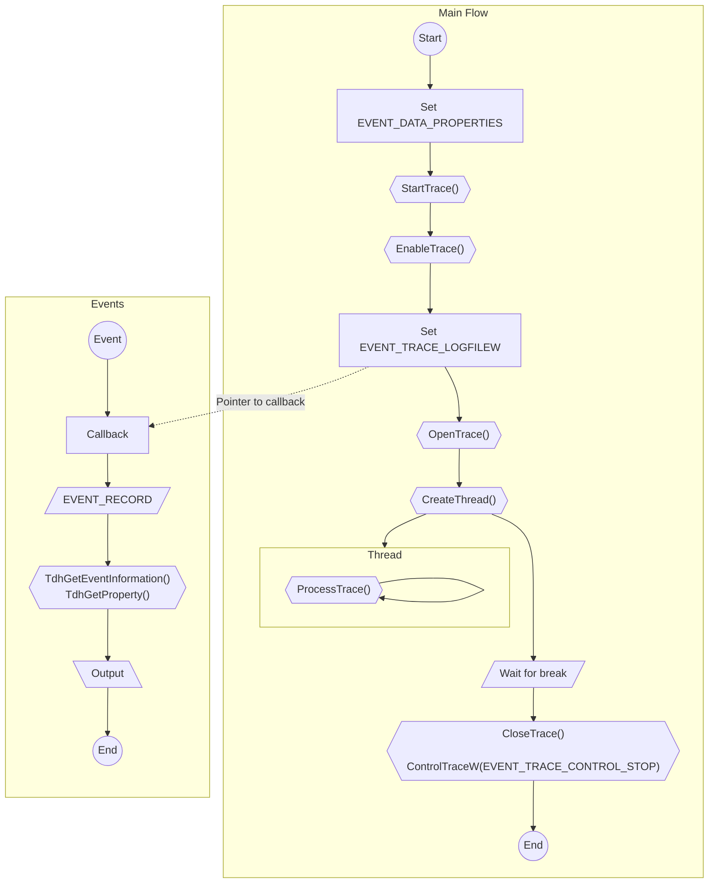

```mermaid
flowchart TD
    MF_OpenTrace{{"OpenTrace()"}}
    MF_W4Break[/Wait for break/]
    MF_Cleanup{{"CloseTrace()
    ControlTraceW(EVENT_TRACE_CONTROL_STOP)"}}
    MF_ProcessTrace{{"ProcessTrace()"}}
    MF_START((Start))
    MF_SetEDP["Set EVENT_DATA_PROPERTIES"]
    MF_StartTrace{{"StartTrace()"}}
    MF_EnableTrace{{"EnableTrace()"}}
    MF_SetETLW["Set EVENT_TRACE_LOGFILEW"]
    MF_CreateThread{{"CreateThread()"}}
    MF_END((End))

    subgraph Main Flow
    MF_START-->MF_SetEDP
    MF_SetEDP-->MF_StartTrace
    MF_StartTrace-->MF_EnableTrace
    MF_EnableTrace-->MF_SetETLW
    MF_SetETLW-->MF_OpenTrace
    MF_OpenTrace-->MF_CreateThread
        subgraph Thread
        MF_ProcessTrace
        MF_ProcessTrace-->MF_ProcessTrace
        end
    MF_CreateThread-->Thread
    MF_CreateThread--->MF_W4Break
    MF_W4Break-->MF_Cleanup
    MF_Cleanup-->MF_END
    end

    MF_SetETLW-.->|Pointer to callback|E_EventCallback

    subgraph Events
    E_Start((Event))-->E_EventCallback[Callback]
    E_EventCallback-->E_EventRecord[/EVENT_RECORD/]
    E_EventRecord-->E_Process{{"TdhGetEventInformation()
    TdhGetProperty()"}}
    E_Process-->E_Output[\Output\]
    E_Output-->E_End((End))
    end
```
