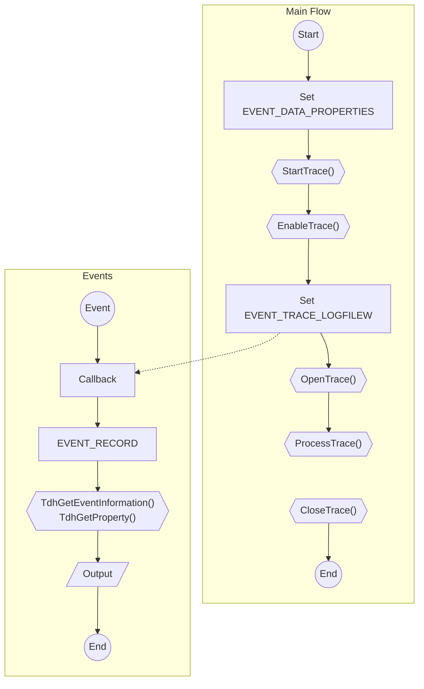

```mermaid
flowchart TD
    MD1-.->ECB
    subgraph Main Flow
    M1((Start))-->MB["Set EVENT_DATA_PROPERTIES"]
    MB-->MC{{"StartTrace()"}}
    MC-->MD{{"EnableTrace()"}}
    MD-->MD1["Set EVENT_TRACE_LOGFILEW"]
    MD1-->MD2{{"OpenTrace()"}}
    MD2-->MD3{{"ProcessTrace()"}}
    MD3~~~MD4{{"CloseTrace()"}}
    MD4-->ME((End))
    end
    subgraph Events
    E((Event))-->ECB[Callback]
    ECB-->E3[EVENT_RECORD]
    E3-->E4{{"TdhGetEventInformation()
    TdhGetProperty()"}}
    E4-->E5[/Output/]
    E5-->E6((End))
    end
```
