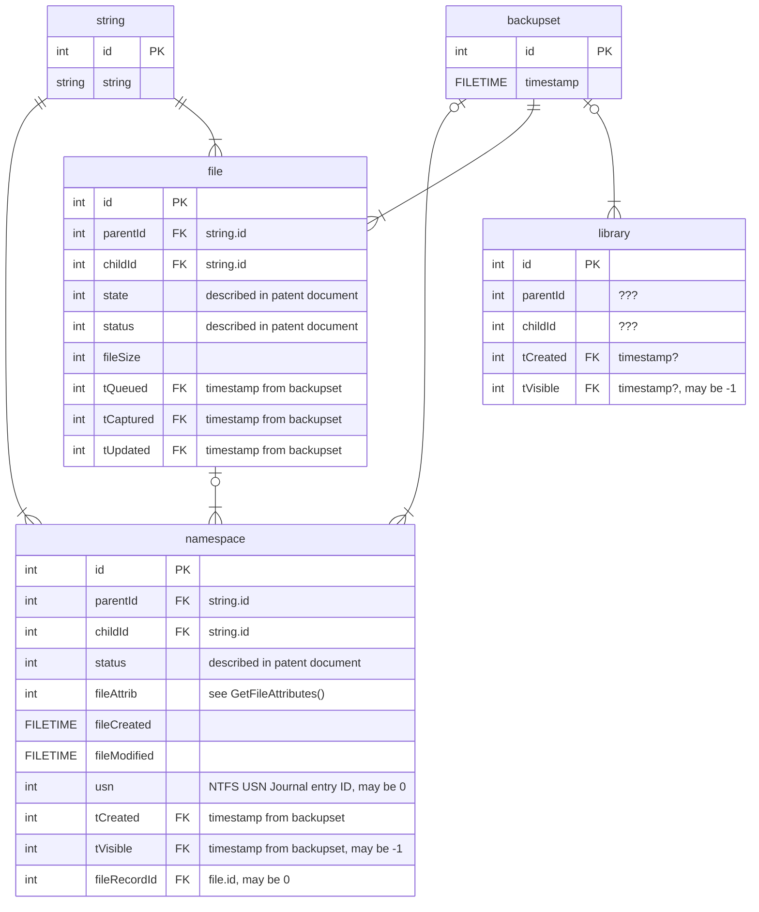

### Forensic value of File History database

File History is a Windows feature that allows users to automatically create a snapshot of selected files and folders on another drive. 
Users can select their own schedule, retention period, included folders, backup location, etc. 
To make the solution working efficiently, Windows keeps the history of operations related to File History in a dedicated ESE (_Extensible Storage Engine_, aka _Jet Blue_) database located in `%localappdata%\Microsoft\Windows\FileHistory\Configuration\`. The database is stored in two mirrored files `Catalog1.edb`, and `Catalog2.edb`. Analysts should pay attention to File History schedule and/or retention. The default values are: snapshot once per hour, never purge. If some changes (such as file creation and deletion) happen between two consecutive snapshots, they may be not reflected in the database.

The content of the database is not officially documented, however one of Microsoft patents (US9824091B2, available at https://patents.google.com/patent/US9824091B2) provides detailed information about tables, structures, field meaning, etc. 

The description seems to be accurate, even if it is a patent description, and not a feature documentation. Some fields (or even tables, such as `library`) may exist in real database but are not mentioned in the patent.

The real `Catalog1.edb` file contains the following tables:
- `backupset` - list of timestamps referred from other tables
- `file` - details about files processed. Includes: state and status (documented in the patent document), file size and references to timestamps related to three different phases of file processing.
- `global` - database details in the key-value form, contains information such as FirstBackupTime, LastBackupTime, etc.
- `library` - not known, does not seem to be valuable from the forensics perspective.
- `namespace` - main table, containing: references to files and folders, status (as described in the patent document), file attributes , file creation and modification timestamps, number of the entry in the _NTFS USN Journal_ related to the last change, reference to the entry in `file` database, references related to timestamps of two processing phases.
- `string` - table contains strings (folder and paths) referred by file and namespace tables.

The structure may be represented by the following graph. The graph in the patent document is slightly different but the overall idea remains very similar.

Despile lack of an official documentation, some subset of the data seems to be relatively easy to understand and interpret, giving an analyst some valuable forensics information. Scenarios may include:
- names of files and folders. Even without context, information about a file/folder existence may provide a value. Compared to the current disk content will provide basic information about deleted files.
- timestamps. Especially, `namespace.fileCreated` and `namespace.fileModified` may provide some useful details.
- file/folder content changes. Changes may be traced historically in conjunction with USN journal, size changes, etc. Analysis may provide precise information about creation/deletion of files.

To simplify processing, the data (all columns from all tables) may be exported to CSV files using the [attached PowerShell script](https://github.com/gtworek/PSBits/blob/master/DFIR/FileHistoryDB2CSV.ps1). Using PowerShell may slow down the processing (e.g. comparing to native binaries such as _Nirsoft ESEDatabaseView_), but the portability of such solution seems to justify scripted approach.

As the data structures are relatively simple, there is no need to create a dedicated analytical tool to cover all possible scenarios. Instead, importing into the Excel tables will allow an analyst to manipulate and filter the data according to current needs. Tables can be joined with VLOOKUP, INDEX/MATCH, XLOOKUP, XMATCH and other standard Excel functions. In case of very large databases, an analyst should pre-filter the data to make sure that no more than 1048576 (2^20) rows appear in the source CSV files.

